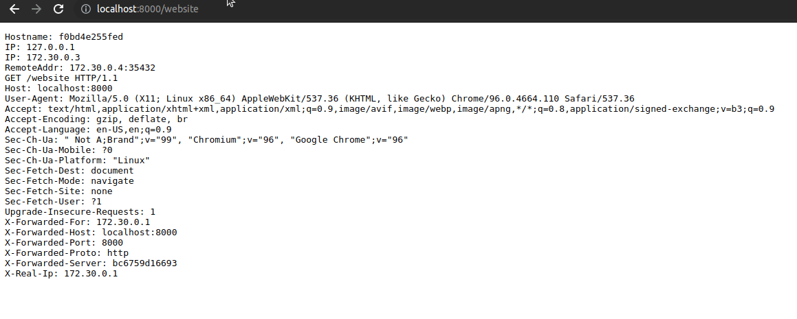

# Traefik Modsecurity Plugin

this is a fork of the original: https://github.com/acouvreur/traefik-modsecurity-plugin

This fork introduces alpine images, and a custom http.transport, and a caching layer once mod-security has processed a request

see:  https://github.com/traefik/plugindemo#troubleshooting

----

Traefik plugin to proxy requests to [owasp/modsecurity-crs](https://hub.docker.com/r/owasp/modsecurity-crs):apache

- [Traefik Modsecurity Plugin](#traefik-modsecurity-plugin)
    - [Demo](#demo)
    - [Usage (docker-compose.yml)](#usage-docker-composeyml)
    - [How it works](#how-it-works)
    - [Local development (docker-compose.local.yml)](#local-development-docker-composelocalyml)

## Demo

Demo with WAF intercepting relative access in query param.

## Usage (docker-compose.yml)

See [docker-compose.yml](docker-compose.yml)

1. docker-compose up
2. Go to http://localhost/website, the request is received without warnings
3. Go to http://localhost/website?test=../etc, the request is intercepted and returned with 403 Forbidden by
   owasp/modsecurity
4. You can you bypass the WAF and check attacks at http://localhost/bypass?test=../etc

## How it works

This is a very simple plugin that proxies the query to the owasp/modsecurity apache container.

The plugin checks that the response from the waf container hasn't an http code > 400 before forwarding the request to
the real service.

If it is > 400, then the error page is returned instead.

The *dummy* service is created so the waf container forward the request to a service and respond with 200 OK all the
time.

*NEW*: Caching modsecurity responses helps to minimize the overhead of processing every request and improves
performance. By generating cache keys based on various factors like the request method, host, request URI, headers, and
remote address, we can ensure that different requests are treated uniquely, while similar requests can be served from
the cache. This approach helps in reducing the load on the modsecurity instance and improves response times for
requests. You can tune this to your liking but we recommend the following options:

## Configuration

This plugin supports these configuration:

* `modSecurityUrl`: (**mandatory**) it's the URL for the owasp/modsecurity container.
* `timeoutMillis`: (optional) timeout in milliseconds for the http client to talk with modsecurity container. (default 2
  seconds)
* `maxBodySize`: (optional) it's the maximum limit for requests body size. Requests exceeding this value will be
  rejected using `HTTP 413 Request Entity Too Large`.
  The default value for this parameter is 10MB. Zero means "use default value".

* `cacheConditionsMethods`: (optional) An array of HTTP methods for which caching is allowed. (default ["GET"])
* `cacheConditionsNoBody`: (optional) Specifies if requests with no body (content-length of 0) should be cached. (
  default true)

* `cacheKeyIncludeMethod`: (optional) Specifies if the HTTP method should be included in the cache key. (default
  true)
* `cacheKeyIncludeHost`: (optional) Specifies if the host should be included in the cache key. (default true)
* `cacheKeyIncludeRequestURI`: (optional) Specifies if the request URI should be included in the cache key. (default
  true)
* `cacheKeyIncludeHeaders`: (optional) Specifies if the headers should be included in the cache key. (default false)
* `cacheKeyHeaders`: (optional) An array of specific headers to be included in the cache key when
  CacheKeyIncludeHeaders is true. (default ["Authorization", "User-Agent", "Cache-Control"])
* `cacheKeyMatchAllHeaders`: (optional) Specifies if all headers should be included in the cache key when
  CacheKeyIncludeHeaders is true. (default false)

**Note**: body of every (non-cached) request will be buffered in memory while the request is in-flight (i.e.: during the
security
check and during the request processing by traefik and the backend), so you may want to tune `maxBodySize` depending on
how much RAM you have.

## Local development (docker-compose.local.yml)

See [docker-compose.local.yml](docker-compose.local.yml)

`docker-compose -f docker-compose.local.yml up` to load the local plugin
